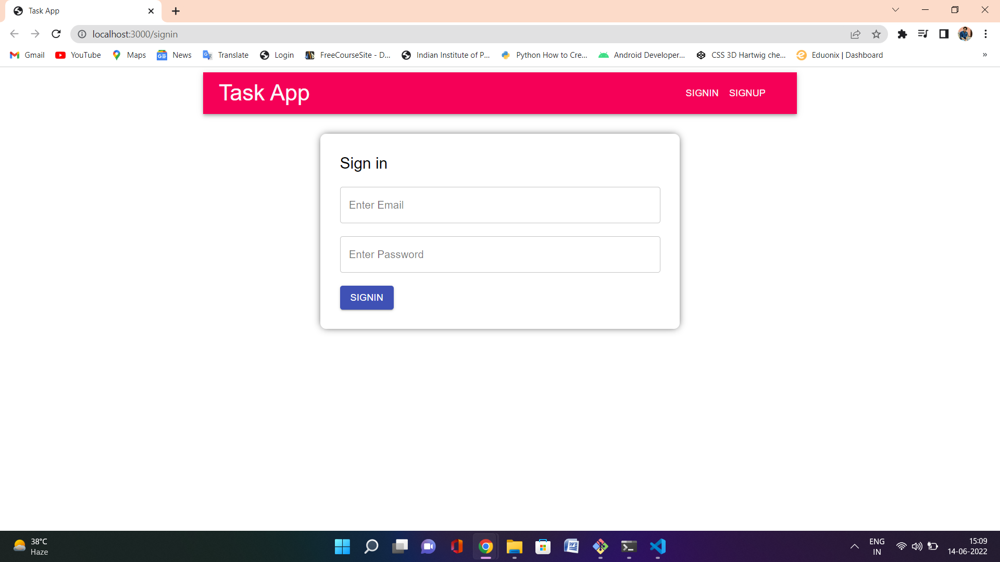
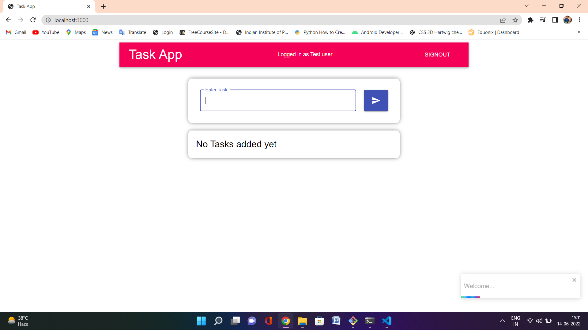

# TaskApp
Locate to frontend folder using :- cd frontend

Now run the project using command :- npm run start

Your project will start and run on localhost:3000 by default locate to this address in your webbrowser

Step 1 :- First of all you will be presnted with signup page

Now signup using the below process

Step 2 :- Now after signup you will be redirected to signin page :- 

Step 3 :- After signing in you will be redirected to homepage :-

Step 4 :- Add your task under Enter task placeholder and click on button to add it :- 

Step 5 :- Click on check button on right side of task to mark task as completed :- 

Step 6 :- Click on edit button on right side of check button to edit the task  :- 

Step 7 :- Click on delete button on right side of edit button to delete task  :- 

This is the TaskApp project created using MERN stack with Redux and JWT token for authentication

Deployment link :- https://gaurav-react-taskapp.netlify.app/signup

